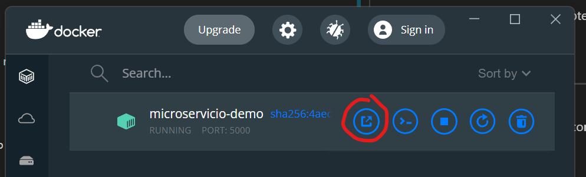
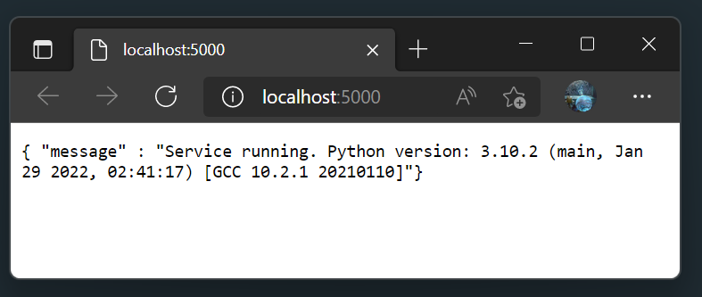
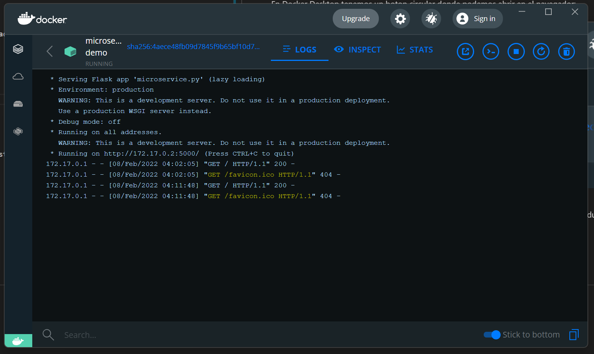

## Sesión 3: Infraestructura como código
 

### Objetivos 🎯

1) Archivos generados por Terraform.
2) Ejemplo proyecto Terraform.
3) Operaciones básicas con Terraform.
4) Realizar llamadas al microservicio.
5) Visualizar el log del contenedor.

### Contenido 📘

Usando Docker en nuestra estación de trabajo nos permite preparar y probar un microsservicio antes de subirlo a una nube. Asi podemos simular un proveedor de contenedores en nube desde nuestro equipo.

Con el uso de Terraform construiremos una imágen, la almacenaremos en el repositorio local y montaremos un contenedor, para luego probar su funcionamiento, revisar el log del contenedor y finalmente destruir el recurso.

El código fuente del servicio lo puedes descargar desde este repositorio en la carpeta ```microservice``` de esta sesión, es un servicio muy simple, creado con Python y Flask, que solo responde con un texto en la ruta ```/``` y metodo ```GET```.

---

### 1) Archivos generados por Terraform. (Ejemplo 1)

Muchos programas pueden generar archivos temporales, logs o de configuraciones personales que no deben subirse a un repositoro por ser de carácter personal, sensible, temporal, interno, etc.

Dirígente al [**`EJEMPLO 1`**](./Ejemplo-01/README.md) para estudiar los archivos que genera Terraform.

Si llegaras a perder los archivos en carpetas ```.terraform``` solo hay que ejecutar nuevamente ```terraform init``` y descargará de nuevo los módulos necesarios para la operación.

El archivos de estado (```*.tfstate```) son muy importantes ya que en ellos esta la información que compone a tu infraestructura creada, sin esta información, terraform no sabe que ya esta creado y que falta por crear. De hecho es tan importante que se recomienda alojar o respaldar estos archivos en algún almacen en la nube (Google Drive, OneDrive, S3 bucket, etc).

Aqui un par de lecturas relacionadas a la pérdida de los archivos de estado:
* [Recovering from State Disasters](https://www.terraform.io/cli/state/recover)
* [Lessons learned after losing the Terraform state file](https://tryingthings.wordpress.com/2021/03/31/lessons-learned-after-losing-the-terraform-state-file/)

---

### 2) Ejemplo proyecto terraform. (Ejemplo 2)

Para este ejemplo tenemos un microservicio demo, y un proyecto de Terraform que construye una imágen y la almacena en el repositorio local de Docker, luego, inicia un contenedor con esta imágen.

- [**`EJEMPLO 2`**](./Ejemplo-02/README.md)
---

### 3) Operaciones con básicas con Terraform

### `init`

Durante init, tf procesa el bloque terraform para inicializar la carpeta de trabajo, descarga los archivos de programa para todos los proveedores que utiliza el módulo. Un proyecto puede tener varios proveedores al mismo tiempo, por ejemplo, Docker, Kubernetes, PostgreSQL, AWS, Google Cloud, etc. Usualmente un proveedor solo crea los recursos de su servicio o producto, entonces los proyectos suelen tener varios proveedores. TF soporta proyectos de nube híbrida, manejando recursos de varios proveedores, enviando o intercambiando información entre ellos.

Aquí la salida de `init` en nuestro `proyecto-tf`:

```
PS: E:\repos\DevOps-Fundamentals-2021\Sesion-03\proyecto-tf> terraform init

Initializing the backend...

Initializing provider plugins...
- Finding kreuzwerker/docker versions matching ">= 2.16.0"...
- Installing kreuzwerker/docker v2.16.0...
- Installed kreuzwerker/docker v2.16.0 (self-signed, key ID BD080C4571C6104C)

Partner and community providers are signed by their developers.
If you'd like to know more about provider signing, you can read about it here:
https://www.terraform.io/docs/cli/plugins/signing.html

Terraform has created a lock file .terraform.lock.hcl to record the provider
selections it made above. Include this file in your version control repository
so that Terraform can guarantee to make the same selections by default when
you run "terraform init" in the future.

Terraform has been successfully initialized!

You may now begin working with Terraform. Try running "terraform plan" to see
any changes that are required for your infrastructure. All Terraform commands
should now work.

If you ever set or change modules or backend configuration for Terraform,
rerun this command to reinitialize your working directory. If you forget, other
commands will detect it and remind you to do so if necessary.
```

En las primeras líneas podemos observar cuando busca en su repositorio de el proveedor `kreuzwerker`, existen varios proveedores para Docker con los que podemos experimentar, podemos buscarlos directamente desde el [Terraform Registry - Search Docker](https://registry.terraform.io/search/providers?q=docker).

Descarga los archivos de programa que componen el proveedor de Docker. Puedes listar el contenido de la descarga, ej:

```
PS E:\repos\DevOps-Fundamentals-2021\Sesion-03\proyecto-tf> ls .\.terraform\providers\registry.terraform.io\kreuzwerker\docker\2.16.0\windows_amd64\


    Directory: E:\repos\DevOps-Fundamentals-2021\Sesion-03\proyecto-tf\.terraform\providers\registry.terraform.io\kreuzwerker\docker\2.16.0\windows_amd64


Mode                 LastWriteTime         Length Name
----                 -------------         ------ ----
-a----          2/7/2022   7:21 PM          31644 CHANGELOG.md
-a----          2/7/2022   7:21 PM          16725 LICENSE
-a----          2/7/2022   7:21 PM           4425 README.md
-a----          2/7/2022   7:21 PM       16840192 terraform-provider-docker_v2.16.0.exe
```

Algunos proveedores como el de AWS pueden ser muy extensos. Realiza el [Reto 1](./Reto-01/README.md).

### `apply`

Esta operación es para aplicar los comandos necesarios para llegar a nuestra infraestructura objetivo. Primeramente tf checará si ya tiene recursos en su archivo de estado, si los hay compara lo que tiene guardado con lo que está en el proveedor, si detecta diferencias crea un plan de acción, que son una serie de cambios necesarios para llegar al nuevo objetivo. Nos muesta ese plan y pide aprovación para ejecutarlo.

Podemos aprovar desde el plan con `--auto-aprove`, aun que esto no es recomendado en operaciones reales, ya que es muy arriesgado, pero siendo nuestro equipo local no debe haber mayor problema. Auto aprove ayuda a que el comando no se detenga para pedir aprovacion manual.

`terraform apply --auto-apply`

> 💡Esta salida esta resumida:

```
Terraform used the selected providers to generate the following execution plan. Resource actions are indicated with the following symbols:
  + create

Terraform will perform the following actions:

  # docker_container.nginx will be created
  + resource "docker_container" "nginx" {
      + must_run         = true
      + name             = "microservicio-demo"
      + start            = true
      + ports {
          + external = 5000
          + internal = 5000
          + ip       = "0.0.0.0"
          + protocol = "tcp"
        }
    }

  # docker_image.microservice will be created
  + resource "docker_image" "microservice" {
      + id          = (known after apply)
      + latest      = (known after apply)
      + name        = "microservice"
      + build {
          + dockerfile = "Dockerfile"
          + path       = "../microservice/."
          + remove     = true
          + tag        = [
              + "microservice:latest",
            ]
        }
    }

Plan: 2 to add, 0 to change, 0 to destroy.
docker_image.microservice: Creating...
docker_image.microservice: Creation complete after 6s [id=sha256:9d2dd8c7a430bbe087c12ed73e1e63a09fc944f9b875110ca81fce141eef72ebmicroservice]
docker_container.nginx: Creating...
docker_container.nginx: Creation complete after 1s [id=0729c8ed849f6554f3895d604551ef9875406b89a9dd161137281d457ee727d8]

Apply complete! Resources: 2 added, 0 changed, 0 destroyed.
```
### `destroy`

Esta operación es para aplicar los comandos necesarios para borrar (destruir) los recursos creados por nuestro proyecto. Este comando se basa en el archivo de estado para listar que recursos eliminar. Si un recurso no se encuentra en el archivo estado, terraform no lo borra.

`terraform destroy --auto-approve`

> 💡Esta salida esta resumida:

```
docker_image.microservice: Refreshing state... [id=sha256:9d2dd8c7a430bbe087c12ed73e1e63a09fc944f9b875110ca81fce141eef72ebmicroservice]
docker_container.nginx: Refreshing state... [id=0729c8ed849f6554f3895d604551ef9875406b89a9dd161137281d457ee727d8]

Terraform used the selected providers to generate the following execution plan. Resource actions are indicated with the following symbols:
  - destroy

Terraform will perform the following actions:

  # docker_container.nginx will be destroyed
  - resource "docker_container" "nginx" {
      - command           = [
          - "flask",
          - "run",
          - "--host=0.0.0.0",
        ] -> null
      - hostname          = "0729c8ed849f" -> null
      - id                = "0729c8ed849f6554f3895d604551ef9875406b89a9dd161137281d457ee727d8" -> null
      - image             = "sha256:9d2dd8c7a430bbe087c12ed73e1e63a09fc944f9b875110ca81fce141eef72eb" -> null
      - name              = "microservicio-demo" -> null
      - network_data      = [
        ] -> null
      - ports {
          - external = 5000 -> null
          - internal = 5000 -> null
          - ip       = "0.0.0.0" -> null
          - protocol = "tcp" -> null
        }
    }

  # docker_image.microservice will be destroyed
  - resource "docker_image" "microservice" {
      - id     = "sha256:9d2dd8c7a430bbe087c12ed73e1e63a09fc944f9b875110ca81fce141eef72ebmicroservice" -> null
      - latest = "sha256:9d2dd8c7a430bbe087c12ed73e1e63a09fc944f9b875110ca81fce141eef72eb" -> null
      - name   = "microservice" -> null

Plan: 0 to add, 0 to change, 2 to destroy.
docker_container.nginx: Destroying... [id=0729c8ed849f6554f3895d604551ef9875406b89a9dd161137281d457ee727d8]
docker_container.nginx: Destruction complete after 0s
docker_image.microservice: Destroying... [id=sha256:9d2dd8c7a430bbe087c12ed73e1e63a09fc944f9b875110ca81fce141eef72ebmicroservice]
docker_image.microservice: Destruction complete after 0s

Destroy complete! Resources: 2 destroyed.
```

> ⚠️ En una situación real, es muy importante revisar todo el plan de acciones, ya que cualquer error puede causar problemas en nuestras aplicaciones. Por lo que `--auto-approve` solo es recomendado para automatización y cuando donde se sabe exactamente lo que se está haciendo, ya sea por que se realizó una revision previa, o por que se esta siguiendo un plan aprovado.
---

### 4) Realizar llamadas al microservicio

Existen muchas formas de probar tu contenedor, usando docker para abrir en el navegador, usando Postman, curl, etc.

En Docker Desktop tenemos un boton circular donde podemos abrir en el navegador:


 

Si das click en el nombre del microservicio podrás ver una ventana los `logs` del conenedor, donde podemos ver las llamadas que hacemos al servicio:



### 3. Postwork 📝

Encuentra las indicaciones y consejos para reflejar los avances de tu proyecto de este módulo.

- [**`POSTWORK SESIÓN 3`**](./Postwork/README.md)
