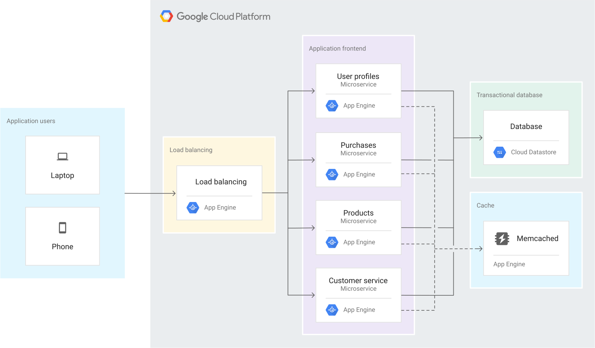

Microservicios completamente administrados
El entorno estándar de App Engine proporciona balanceo de cargas integrado, ajuste de escala automático, registros y supervisión completamente integrados y redundancia regional. No hay infraestructura que administrar.

Flexibilidad de lenguaje y entorno de ejecución
Los entornos de ejecución están disponibles para los siguientes lenguajes de computación: Python, Java, Go, Node.js, Ruby y PHP. Los servicios independientes, aislados y con control de versiones en diferentes lenguajes te permiten implementar microservicios de producción en segundos.

Integración en toda la plataforma
El entorno estándar de App Engine proporciona integración con los servicios de Google Cloud para almacenamiento de datos (Datastore, Firestore, Cloud SQL), cron (Cloud Scheduler), tareas (Cloud Tasks), almacenamiento en caché (Memorystore) y mucho más.
