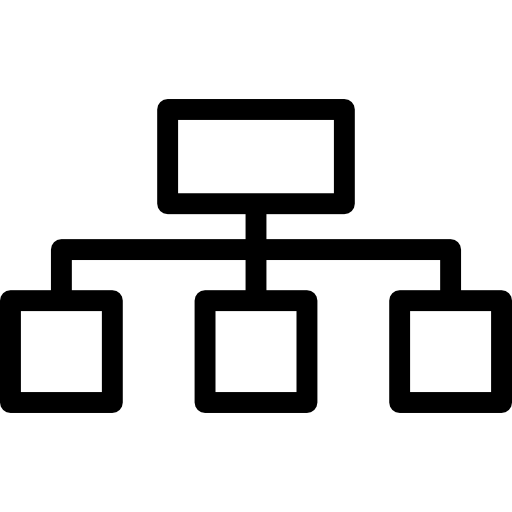

## Sesión 4: Arquitectura de microservicios

### 1. Objetivos 🎯

- Reconocer el IDE Android Studio con el que desarrollan aplicaciones móviles.
- Conocer la estructura de un proyecto android y todos los archivos generados por el IDE

### 2. Contenido 📘

En este work abordaremos ejemplos de patrones y soluciones en las nubes de Azure, Google Cloud y AWS. 

---
### Ejemplo 1. Modelos de diseño de microservicios con Azure
El objetivo de los microservicios es aumentar la velocidad de las versiones de la aplicación mediante la descomposición de la aplicación en servicios autónomos pequeños que se pueden implementar de forma independiente. Una arquitectura de microservicios también conlleva algunos desafíos. Los modelos de diseño que se muestran aquí pueden ayudar a mitigar estos desafíos.

El patrón [Ambassador](https://docs.microsoft.com/es-es/azure/architecture/patterns/ambassador) se puede usar para la descarga de tareas comunes de conectividad de cliente, como la supervisión, el registro, el enrutamiento, la seguridad (por ejemplo, TLS) de una manera independiente del lenguaje. Los servicios de Ambassador se suelen implementar como un sidecar (consulte a continuación).

El patrón [Anti-Corruption Layer](https://docs.microsoft.com/es-es/azure/architecture/patterns/anti-corruption-layer) implementa una fachada entre aplicaciones nuevas y heredadas para garantizar que el diseño de una nueva aplicación no está limitado por dependencias en sistemas heredados.

El patrón [Backends for Frontends](https://docs.microsoft.com/es-es/azure/architecture/patterns/backends-for-frontends) crea servicios de back-end independientes para distintos tipos de clientes, como equipos de escritorio y móviles. De este modo, no es necesario que un único servicio de back-end controle los requisitos conflictivos de varios tipos de cliente. Este patrón puede ayudar a mantener cada microservicio simple gracias a la separación de problemas específicos del cliente.

El patrón [Bulkhead](https://docs.microsoft.com/es-es/azure/architecture/patterns/bulkhead) aísla los recursos críticos, como el grupo de conexiones, la memoria y la CPU, para cada carga de trabajo o servicio. Al usar patrones Bulkhead, una sola carga de trabajo (o servicio) no puede consumir todos los recursos, lo que privaría a otros. Este patrón aumenta la resistencia del sistema al evitar los errores en cascada causados por un servicio.

[Agregación de puertas de enlace](https://docs.microsoft.com/es-es/azure/architecture/patterns/gateway-aggregation) agrega solicitudes a varios microservicios individuales en una sola solicitud, lo que reduce el intercambio de mensajes entre los consumidores y los servicios.

[Descarga con puertas de enlace](https://docs.microsoft.com/es-es/azure/architecture/patterns/gateway-offloading) permite que cada microservicio descargue la funcionalidad de servicio compartido, como el uso de certificados SSL, a una puerta de enlace de API.

[Enrutamiento de puerta de enlace](https://docs.microsoft.com/es-es/azure/architecture/patterns/gateway-routing) enruta las solicitudes a varios microservicios mediante un único punto de conexión para que los consumidores no tengan que administrar muchos puntos de conexión independientes.

[Sidecar](https://docs.microsoft.com/es-es/azure/architecture/patterns/sidecar) implementa componentes de una aplicación auxiliar como un proceso o contenedor independiente para proporcionar aislamiento y encapsulación.

[Strangler Fig](https://docs.microsoft.com/es-es/azure/architecture/patterns/strangler-fig) admite la refactorización incremental de una aplicación mediante el reemplazo gradual de funciones específicas por servicios nuevos.

Para obtener el catálogo completo de modelos de diseño en la nube en el Centro de arquitectura de Azure, consulte [Modelos de diseño en la nube](https://docs.microsoft.com/es-es/azure/architecture/patterns/).

#### Contenido recomendado
[Identificación de los límites de los microservicios - Azure Architecture Center](https://docs.microsoft.com/es-es/azure/architecture/microservices/model/microservice-boundaries)
Obtenga información sobre cómo empezar a partir de un modelo de dominio cuidadosamente diseñado para determinar el tamaño adecuado de un microservicio.
[Análisis de dominios para microservicios - Azure Architecture Center](https://docs.microsoft.com/es-es/azure/architecture/microservices/model/domain-analysis)
En este artículo se ofrece un enfoque basado en dominios para el diseño de microservicios, de tal manera que cada servicio siga el principio general de hacer solo una cosa.
[Uso de un diseño basado en dominios táctico para diseñar microservicios - Azure Architecture Center](https://docs.microsoft.com/es-es/azure/architecture/microservices/model/tactical-ddd)
Use el diseño basado en dominios en una arquitectura de microservicios para identificar los patrones de entidades y agregados, que permiten determinar los límites naturales de los servicios.
[Diseño de una arquitectura de microservicios - Azure Architecture Center](https://docs.microsoft.com/es-es/azure/architecture/microservices/design/)
Aprenda a diseñar y compilar una arquitectura de microservicios en Azure siguiendo una implementación de referencia que ilustra los procedimientos recomendados.
[Comunicación entre servicios en los microservicios - Azure Architecture Center](https://docs.microsoft.com/es-es/azure/architecture/microservices/design/interservice-communication)
Conozca las concesiones entre la mensajería asincrónica y las API sincrónicas en relación con la comunicación entre microservicios, así como algunos desafíos de comunicación.
[Patrón de capa anticorrupción - Cloud Design Patterns](https://docs.microsoft.com/es-es/azure/architecture/patterns/anti-corruption-layer)
Examine el patrón de capa anticorrupción. Implementa una capa de fachada o de adaptador entre una aplicación moderna y un sistema heredado.
[Consideraciones de datos para los microservicios - Azure Architecture Center](https://docs.microsoft.com/es-es/azure/architecture/microservices/design/data-considerations)
Obtenga información sobre cómo administrar datos en una arquitectura de microservicios. La integridad y la coherencia de los datos suponen importantes desafíos en relación con los microservicios.
[Patrón Backends for Frontends - Cloud Design Patterns](https://docs.microsoft.com/es-es/azure/architecture/patterns/backends-for-frontends)
Explore el patrón Back-ends para front-ends, que crea servicios de back-end independientes para que los consuman aplicaciones o interfaces de front-end específicas.

---

 

### Tema 2. Microservicios con App Engine 
Usa el entorno estándar de App Engine para proporcionar balanceo de cargas integrado, ajuste de escala automático, registro y supervisión completamente integrados, y redundancia regional.

Microservicios completamente administrados
El entorno estándar de App Engine proporciona balanceo de cargas integrado, ajuste de escala automático, registros y supervisión completamente integrados y redundancia regional. No hay infraestructura que administrar.

Flexibilidad de lenguaje y entorno de ejecución
Los entornos de ejecución están disponibles para los siguientes lenguajes de computación: Python, Java, Go, Node.js, Ruby y PHP. Los servicios independientes, aislados y con control de versiones en diferentes lenguajes te permiten implementar microservicios de producción en segundos.

Integración en toda la plataforma
El entorno estándar de App Engine proporciona integración con los servicios de Google Cloud para almacenamiento de datos (Datastore, Firestore, Cloud SQL), cron (Cloud Scheduler), tareas (Cloud Tasks), almacenamiento en caché (Memorystore) y mucho más.

---

### Tema 3. Arquitectura de Microservicios con Amazon AWS
Amazon nos provee una serie de servicios interesantes para construir arquitecturas basadas en microservicios: Lambda, EC2 con VPC y Fargate (para trabajar con contenedores y Kubernetes), comúnmente denominado ECS (Amazon Elastic Container Service).

En este artículo me centraré en explicar el funcionamiento de Lambda a través de un ejemplo concreto y cómo nos podría ayudar a migrar aplicaciones monolíticas en sendas plataformas en la nube basadas en arquitecturas de microservicios.

Un poco de teoría (que siempre ayuda)

Lambda se basa en un concepto de computación en la nube denominado Serverless. ¿qué significa esto?

Básicamente Serverless es sin servidor. El serverless computing o la arquitectura serverless es un modelo en la nube que permite a los usuarios crear y ejecutar aplicaciones y procesos sin entrar en contacto con el servidor. Por lo tanto, a pesar de su denominación, estos entornos en la nube también cuentan con servidores, con la diferencia de que es el proveedor (Amazon en este caso) el que se encarga de suministrarlo, gestionarlo y escalarlo. Serverless es parte de lo que se conoce como [Plataformas como Servicios (PaaS)](https://azure.microsoft.com/es-es/overview/what-is-paas/).

La ventaja de este tipo de arquitectura en la nube es evidente, nos permite centrarnos en el desarrollo del producto y la ejecución del software, más que en la infraestructura capaz de soportar este desarrollo. Podemos ponerle más atención a la lógica de negocios de nuestra aplicación, sin embargo, desde el mismo código debemos agregar instrucciones adicionales como las funciones sin estado y todas aquellas instrucciones acerca de cómo debe reaccionar un programa a determinados eventos. Debido precisamente al papel esencial que juegan las funciones, hay proveedores que ofrecen sus servicios serverless bajo el nombre “Function as a Service (FaaS)” y acá es donde entra Lambda de Amazon AWS.

    Los proveedores de serverless computing no solo son los responsables de que los recursos de servidor necesarios estén siempre disponibles, sino también de garantizar el mayor nivel de seguridad y alta disponibilidad posible. Por norma general, estos servicios suelen facturarse según el modelo de pago por uso o Pay per Use, de manera que los clientes solo tienen que pagar por los servicios de los que de hecho han disfrutado.

    HTTPS://AWS.AMAZON.COM/ES/SERVERLESS/

<i>
Patrón arquitectónico para microservicios con Lambda. Fuente: Amazon AWS. https://docs.aws.amazon.com/whitepapers/latest/serverless-multi-tier-architectures-api-gateway-lambda/microservices-with-lambda.html
El patrón de arquitectura de microservicio no está vinculado a la arquitectura típica de tres capas (3 tiers); sin embargo, este patrón popular puede obtener importantes beneficios del uso de recursos sin servidor.</i>
 

En esta arquitectura, cada uno de los componentes de la aplicación se desacopla y se implementa y opera de forma independiente. Una API creada con Amazon API Gateway y funciones ejecutadas posteriormente por AWS Lambda es todo lo que necesita para construir un microservicio. El equipo de desarrollo es libre de utilizar estos servicios para desacoplar y fragmentar su entorno al nivel de granularidad deseado.

En general, un entorno de microservicios puede presentar las siguientes dificultades: sobrecarga repetida para crear cada nuevo microservicio, problemas con la optimización de la densidad / utilización del servidor, complejidad de ejecutar múltiples versiones de múltiples microservicios simultáneamente y proliferación de requisitos de código del lado del cliente para integrar los servicios de forma separada.

Cuando se crean microservicios utilizando recursos sin servidor, estos problemas se vuelven más fáciles de resolver y, en algunos casos, simplemente desaparecen. El patrón de microservicios sin servidor reduce la barrera para la creación de cada microservicio posterior (Amazon API Gateway incluso permite la clonación de API existentes y el uso de funciones Lambda en otras cuentas -tal y como se aprecia en la imagen-). La optimización de la utilización del servidor ya no es relevante con este patrón de arquitectura.

---

 

### 3. Postwork 📝

Encuentra las indicaciones y consejos para reflejar los avances de tu proyecto de este módulo.

- [**`POSTWORK SESIÓN 4`**](./Postwork/)

