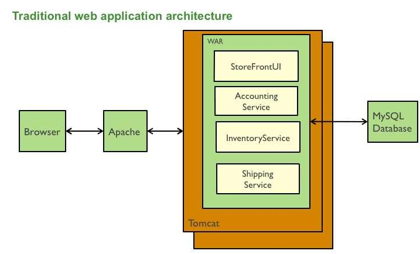

# Reto 1 - Comunicaciones entre contenedors.

## Objetivo 🎯
* Aplicar los conocimientos adquiridos para trasladar una aplicación web monolítica a microservicios.

## Desarrollo 📝

Considera el siguiente diagrama de una aplicación en un servidor, diseña su equivalente utilizando los principios de diseño de microservicios:

Comparte tus ideas y resultados con el instructor.

> 💡 [Propuesta solución](./psolv.md).
