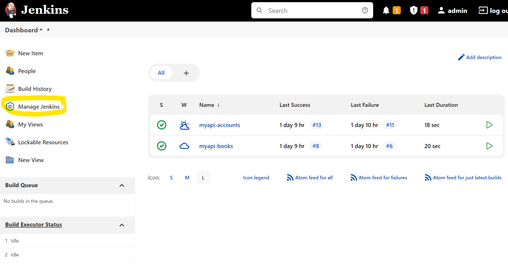
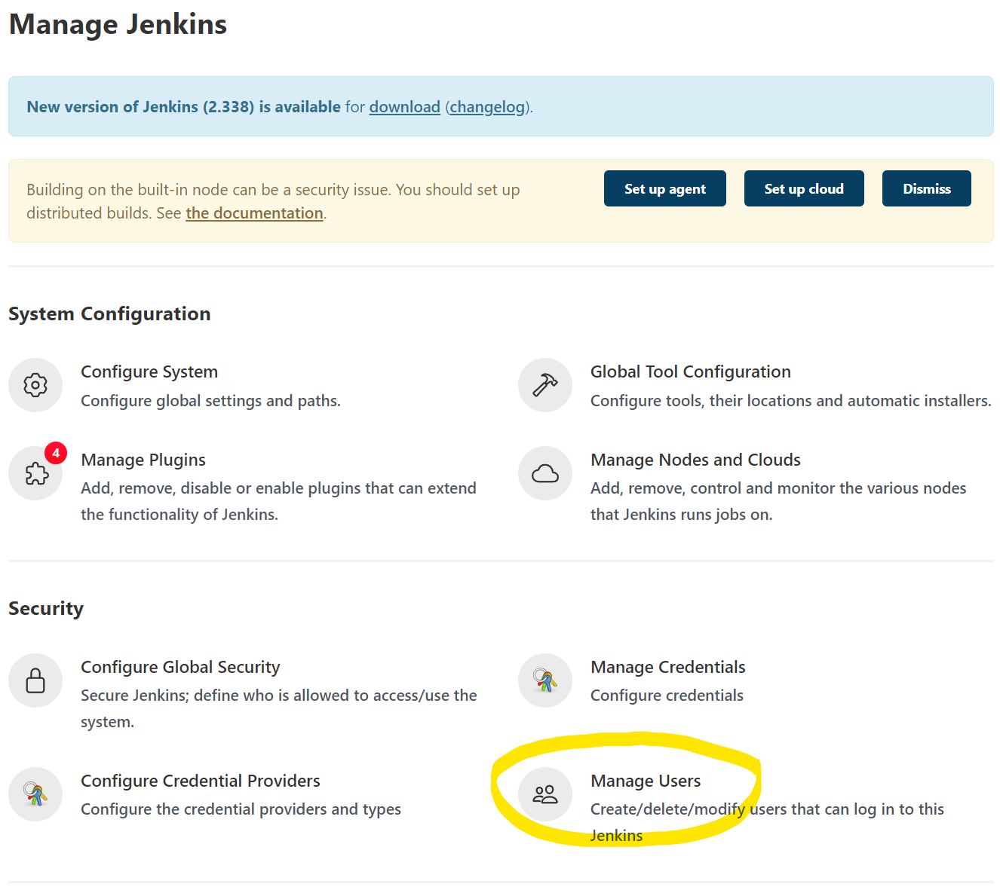
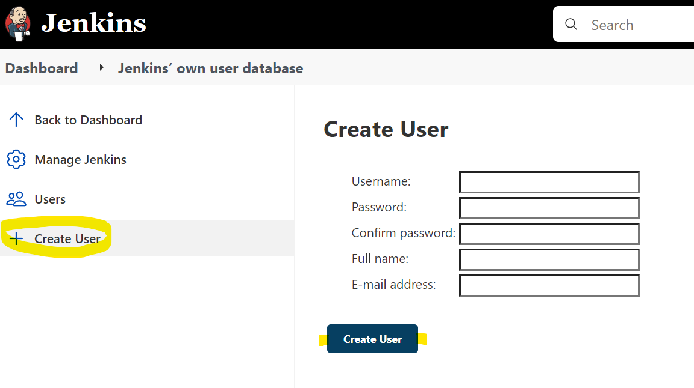

# Solución Reto 1.

## 1 Ubica y accede al menú de configuraciones:

---

## 2 Accede al la sección de administración de usuarios:

---

## 3 Selecciona el sub menú de crear usuario:

## 4 Llena todos los campos y presiona en el botón de crear usuario.

---

## 5 Prueba cerrando la sesión actual e ingresando con tu nuevo usuario.