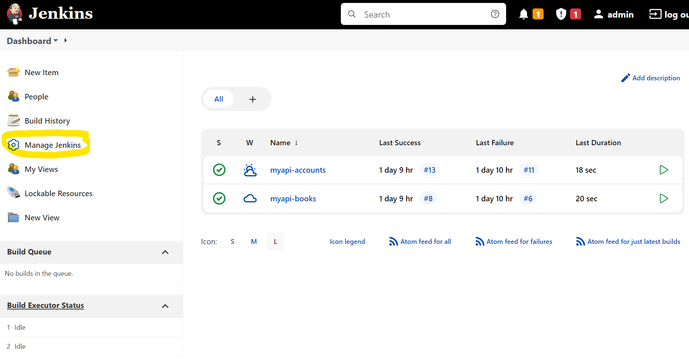
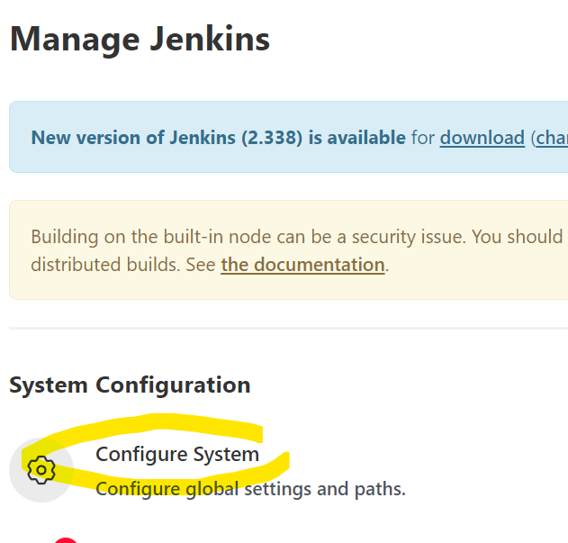
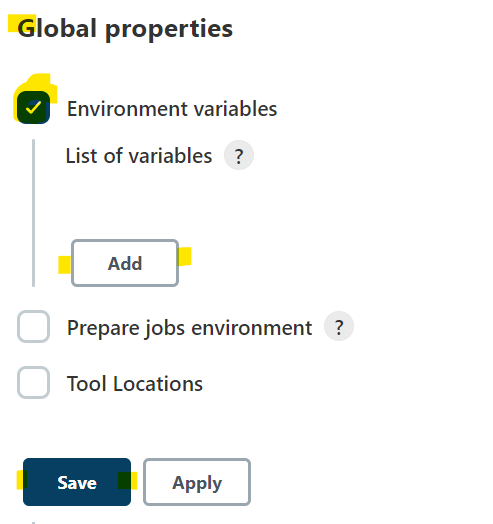
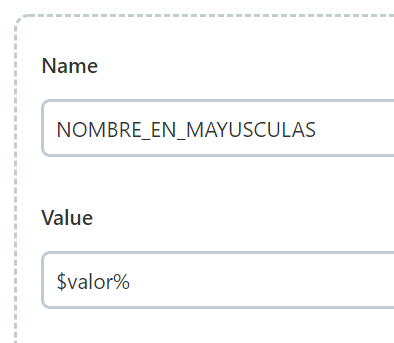
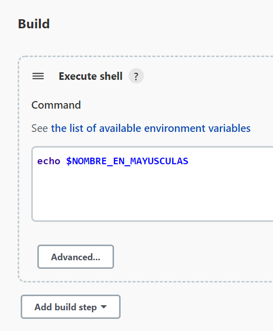
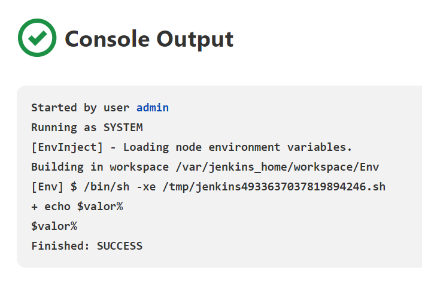

# Solución Reto 2.

## 1 Ubica y accede al menú de configuraciones:

---

## 2 Accede al la sección Configurar Sistema:

---

## 3 Desplázate hacia abajo, palomea la sección de Variables de entorno, el botón para agregar variables se muestra, dar click en ese botón agrega una nueva variable:

## 4 Creascribe tu variable, y guarda configuración:

---

## 5 Usala en projectos de la siguiente manera:

Crea un nuevo projecto, ve a la seccion de Build, agrega un Build Step de tipo execute shell y muestra con `echo $NOMBRE_VAR` de acuerdo al ejemplo del paso 4:

## 5 Comprueba el valor en tiempo de ejecución:

Ejecuta el projecto y muestra el resultado de la consola:

