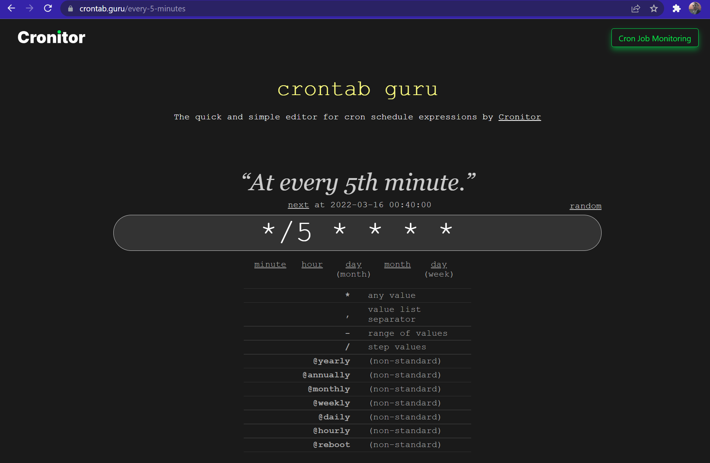
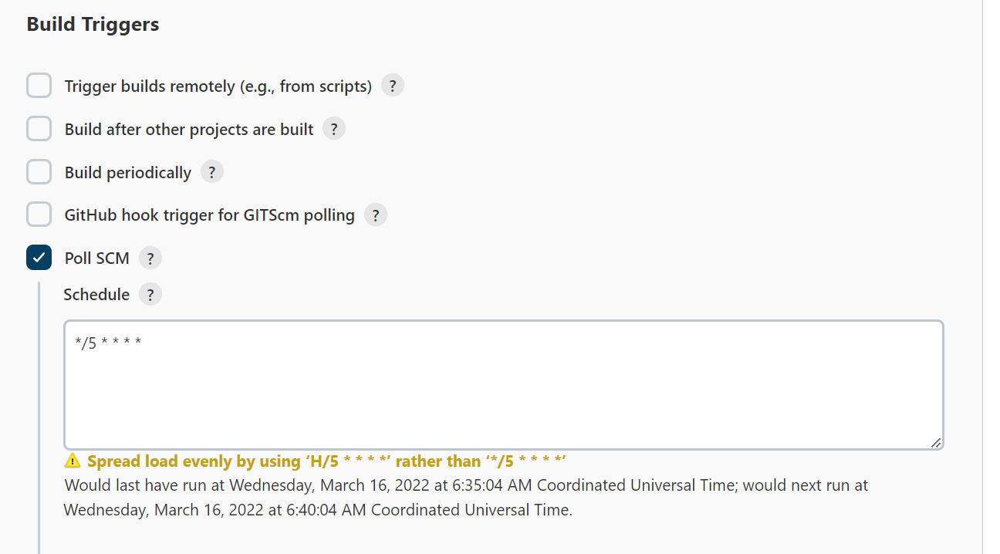

# Solución Reto 3.

## 1 Consulta esta página para construir una expresión cron:

---

## 2 Al crear el nuevo projecto, escribe la expresión en el recuadro de Poll SCM:

---

💡 Para saber mas de las expresiones crontab, puedes consultar [esta página](https://blog.desdelinux.net/cron-crontab-explicados/).